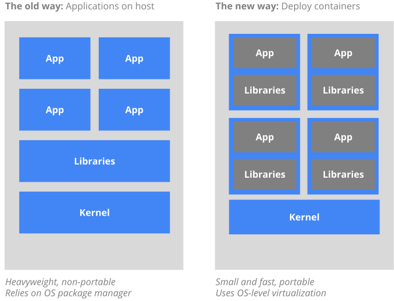

# Kubernetes

 <!-- {_ height="40%" width="40% style="border-width: 0;"  } -->

---

## Recap 
### Why containers

--

## Wat is kubernetes

* Container orchestrator
* Orchestreert netwerk, storage, applicaties
* Desired state engine

--

## Architectuur

--

## Componenten
### Master
* API server
* Scheduler
* Controllermanager
* etcd

--

## Componenten
### Node
* Kubelet
* Kube-proxy
* Container runtime

---

## Installatie

* minishift
* ansible

---

## Concepten

* Pod
* Service
* Replicaset
* Deployment
* PersistentVolume
* PersistentVolumeClaim

--

## Networking

Kubernetes managed netwerken via de "Container Networking Interface" (CNI)
Er zijn vele plugins beschikbaar zoals vlan, bridge, en diverse soorten overlay netwerken.
* flannel
* weavenet
* openvswitch
* kuryr (openstack)

---

## Advanced topics
* Secrets
* Configmaps
* Ingress
* Quotas
* Networkpolicy
* ServiceAccount
* PodSecurityPolicy
* RBAC

---

# Demo

---

## Links

Presentatie https://wouterhummelink.github.io/kubernetes.html
Workshop materiaal https://github.com/wouterhummelink/kubernetes-workshop.git
